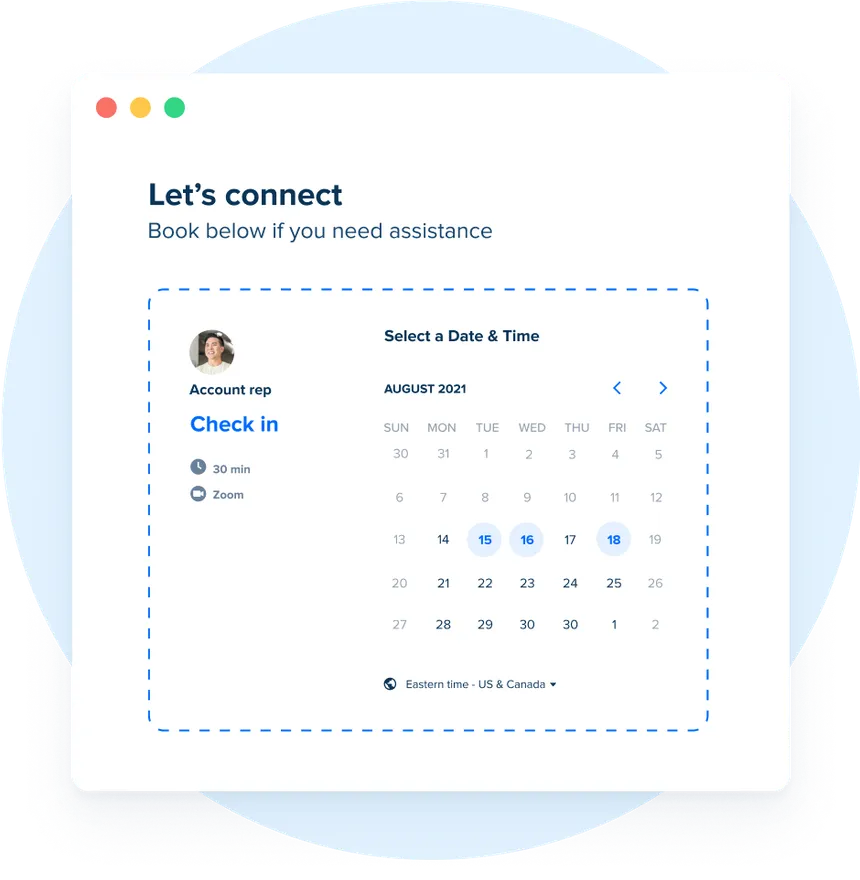
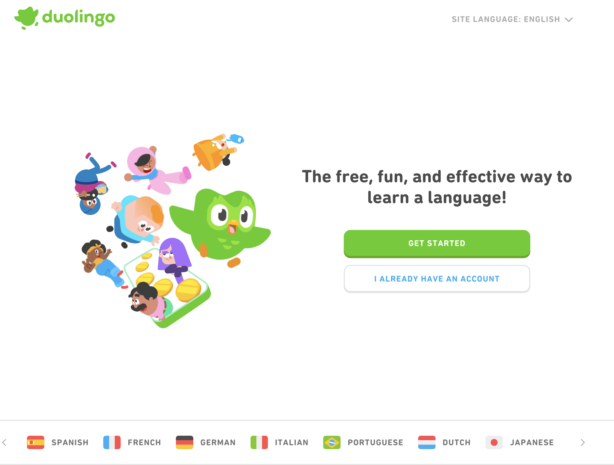

# Identifying Pain Points

[Video](https://youtu.be/lBFe-QZHOls)

## Introduction
In this lesson, we will explore the concept of pain points—specific problems or annoyances that people face in their daily lives. Identifying these pain points is crucial for developing effective solutions, particularly as you plan to build your application. 

Think about a couple of pain points in your life that you'd like to solve. It's beneficial to brainstorm multiple ideas so you have options to choose from.

## Noticing Pain Points
> "The verb you want to be using with respect to startup ideas is not 'think up' but 'notice.'"  
> — Paul Graham, [How to Get Startup Ideas](http://paulgraham.com/startupideas.html)

- The goal here is to discover a good first learning project, not necessarily to change the world just yet. 
- Try to *notice* real annoyances at work, home, or with friends that we can solve—even if it’s just for one user: you.

## Urgent Problems
> "Find someone with a really urgent problem. Imagine your arm is pinned underneath a boulder. You have two options: gnaw off your own arm or sign an LOI with this promising young startup. That’s the kind of customer you want."  
> — Paul Buchheit, [The Path to $100B](https://www.youtube.com/watch?v=Ir3hGtg0Wog&t=2910s)

## Vitamin, Pain Killer, or Cure?
When evaluating a product or service, think about the benefits it provides to its users:

- **Vitamin**: Indirect, long-term benefits that address general health or minor problems. Nice to have; it won't wreck your day if you forget to take them.
- **Pain Killer**: Necessary short-term fixes to pressing issues that may not solve the underlying problem. <-- good place to be
- **Cure**: Completely eliminates the problem.
- **Pain Inducer**: Creates additional discomfort or frustration for users.

The customers' willingness to pay often depends on the urgency of their need for your product. People are willing to pay significantly more for cures than for vitamins.

> "Are people deeply passionate about what you're doing? Do customers love your product? It’s more important to measure love than growth. If people absolutely love your product, they’re going to tell others, and your product is going to grow."  
> — Brian Chesky (Airbnb)

## Pain Inducers
- Be cautious not to create additional pain for your users; this is worse than offering a vitamin.
- Can you think of any pain inducers in existing products or services?

## Examples of Pain Points and Solutions
Let's examine some real-world examples:

## Examples of Pain Points and Solutions
Let's examine some real-world examples and where they land on the User Benefit spectrum:

### Zoom

- **Pain Point**: Need for effective remote communication, especially during the rise of remote work and education.
- **Solution**: A user-friendly video conferencing platform that integrates with various systems for collaboration.
- **User**: 
  - **Employees**: Facilitates remote work, improving collaboration and productivity.
  - **Educators**: Enables distance learning and engagement with students.
  - **Businesses**: Reduces travel costs and enhances communication efficiency.
- **Benefit**: **Pain Killer** - Addresses immediate communication needs but may not solve all aspects of remote collaboration.

### Calendly

- **Pain Point**: The back-and-forth of scheduling meetings or appointments.
- **Solution**: A tool that simplifies scheduling without the need for endless emails.
- **User**: 
  - **Individuals**: Saves time and effort when organizing meetings.
  - **Businesses**: Streamlines scheduling processes, enhancing productivity.
- **Benefit**: **Pain Killer** - Alleviates the frustration of scheduling but doesn't eliminate the need for meetings.

### Duolingo

- **Pain Point**: The cost and complexity of learning a new language.
- **Solution**: A gamified, free language-learning platform.
- **User**: 
  - **Learners**: Affordable and engaging language learning that fits into busy schedules.
  - **Travelers**: Prepares users for travel by building language skills in a fun way.
- **Benefit**: **Vitamin** - Offers valuable learning opportunities but is not a necessity for everyday functioning.

### Uber

- **Pain Point**: Getting from one place to another can be expensive and slow.
- **Solution**: A mobile app that connects users with drivers for quick transportation.
- **User Benefit**: 
  - **Riders**: Convenient, reliable transportation at competitive rates.
  - **Drivers**: Flexible job opportunities and the ability to earn on their own schedule.
- **Category**: **Pain Killer** - Provides a fast and convenient way to travel but doesn't eliminate the need for transportation.

## Understanding the Job
Understanding a product's actual job makes improving the product easier. Clayton Christensen, a professor at Harvard Business School, discusses this concept in his presentation, [Understanding the Job](https://www.youtube.com/watch?v=sfGtw2C95Ms).

One of Christensen’s famous examples involves studying why customers buy milkshakes. He found that many customers purchased milkshakes in the morning to satisfy a specific job they needed done: they wanted something to keep them full during their long commutes. Here are some key takeaways from his research:

- **Context Matters**: Customers don't just buy products for the sake of the product itself; they buy them to fulfill a job in a specific context. In the case of the milkshake, the job was to provide a quick, easy meal replacement that would keep them satisfied on their way to work.
- **Customer Insights**: By observing customers and understanding the job they were trying to accomplish, Christensen's team discovered that the thick texture of the milkshake was not a barrier but an asset—it took longer to consume, which helped satisfy customers during their lengthy commutes. 
- **Simplicity and Specificity**: When defining a product’s job, it’s essential to be specific. Instead of categorizing milkshakes simply as a sweet treat, recognizing them as a tool for busy commuters looking for a quick meal solution revealed opportunities for innovation.
- **Iterative Improvement**: Understanding the job helps teams iterate on their products more effectively. If a company realizes that the milkshake's job is to fill a gap during the commute, they might explore different flavors, sizes, or packaging to better serve that need.

In summary, focusing on the "job to be done" perspective can provide valuable insights into product development. By identifying what job your target users are hiring your product to do, you can create solutions that resonate deeply and meet their specific needs more effectively.

## Conclusion
Identifying and addressing pain points is essential for developing successful solutions. As you think about your own projects, remember to focus on real problems and how your ideas can provide effective solutions.

- Approximately how long (in minutes) did this lesson take you to complete?
{: .free_text_number #time_taken title="Time taken" points="1" answer="any" }
